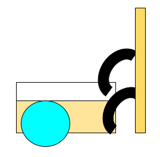
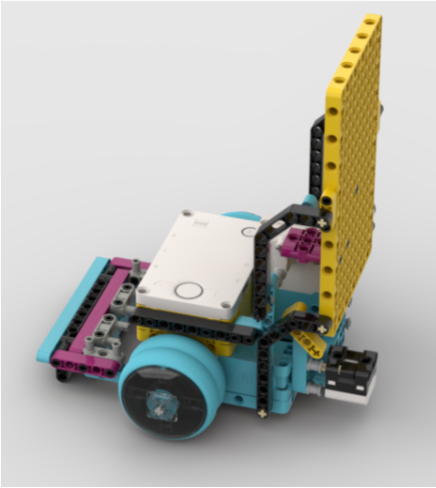
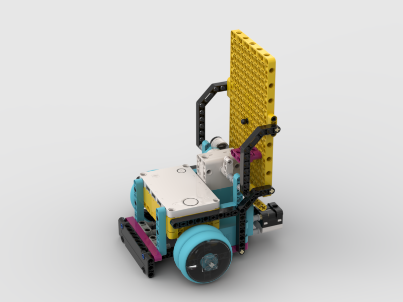
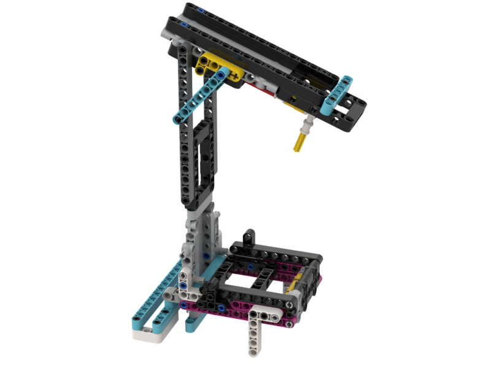
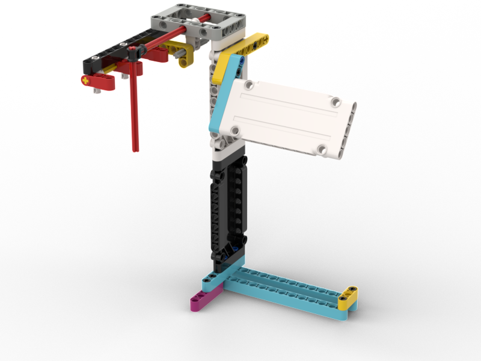

# Superpowered Dregos
First Lego League - Superpowered - Team Dregos

## Our Robot
We started with a design we found on youtube. The creator gave permisson to use and improve the design in the youtube video. THe creator also had a link to a design file which made improving the design easier in studio.

<table>
  <thead><td><b>Version</b></td><td><b>Design</b></td><td><b>Notes</b></td></thead>
  <tr><td>1</td><td></td><td>Found a basic design online with instructions. Seems easy to get started and easy to change if we need to. Passive attachments can be added by dropping robot on them. Active attachments are connected to Yellow plate.

Oct 10 2022
I saw on youtube that robots were using both the front and the back to complete missions. Our robot only uses the front, we need to come up with a design to use the front and back. I also think the back can be used as a bumper or pusher like the front except it doesn’t move.
So maybe we can use it for more attachments.

Another problem we had last year was when the wheels would split when carrying something heavy. I think if we added more wheels our robot won’t slip as much. I’m not sure if this will make the robot turn better or not.

</td></tr>
  <tr><td>2</td><td></td><td>Adds back bumper that can connect to passive attachments and extra wheels for more push/pull traction.

    Wiring reference: A=right motor, E=left motor, C=back motor, F=Sensor

Oct. 27, 2022 I was test driving the robot today and a lot of people were saying it was very long. Can we make the robot shorter?</td></tr>
  <tr><td>3</td><td></td><td></td></tr>
</table>

## Our Attachments
We decided to use a set of passive attachments to keep our programing simple and focused on moving around the board. Passive attachments can help line up our robot with the missions.

<table>
  <thead><td><b>Name</b></td><td><b>Design</b></td><td><b>Version</b></td><td><b>Notes</b></td></thead>
  <tr><td>Basket</td><td></td><td>2</td><td></td></tr>
  <tr><td>Wedge</td><td></td><td>2</td><td></td></tr>
  <tr><td>Tall Dropper</td><td></td><td>1</td><td></td></tr>
  <tr><td>Small Dropper</td><td></td><td>1</td><td></td></tr>
  <tr><td>Catcher</td><td></td><td>2</td><td></td></tr>
  <tr><td>Hydro Dropper</td><td></td><td>1</td><td></td></tr>
</table>

## Contributors
Due to the age and privacy of our team members we cannot share their names. 
We can tell you that they are each equally cool and fun to work with.
