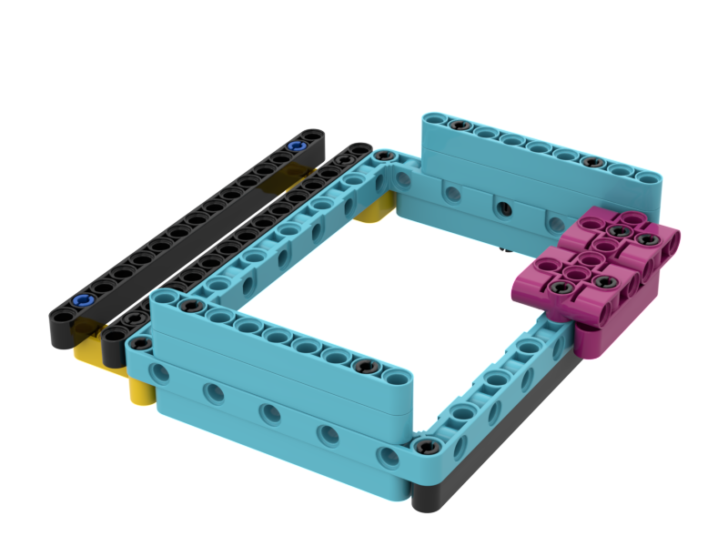
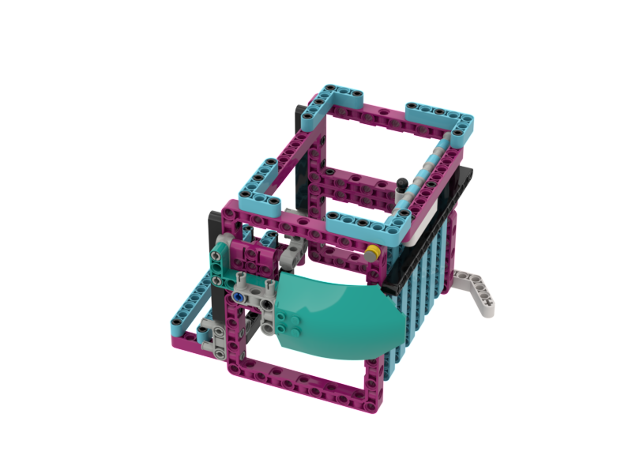

# Superpowered Dregos
First Lego League - Superpowered - Team Dregos

## Introduction
Last year was the first year in FIRST(r) LEGO(r) League for our team and this year we added many new members to our team. 
Even though we only had 1 year of experience and we didn't get to compete we did learn a lot that we brought into Super Powered.

### Attachments VS Code
Last year we decided to build very few attachments and instead rely on our code to complete all of the missions. So once the robot and two attachments were created there wasn't much left for many of our team members to do. Since only one set of code could connect to the robot at a time we had a difficult time scheduling time on the robot to program and test our mission solutions. This year by choosing to build more attachments and by designing passive attachments we could get more of our team members designing and building attachments, making changes to the attachments and participating in the building of our solutions. Thanks to these attachments it greatly reduced the skill level needed to code our robot. The majority of our code now was focused on moving the bot back and forth and turning left and right.

### Passive vs Active Attachments
We learned last year that the active attachments we created, (active meaning that a motor or gear was required to move the attachment in order to complete the mission) required more precision driving and added more delay to our missions. To compensate we had to develop more sophisitcated code taht could move the attachments while we were in motion. We also noticed that the problems our robot would encounter would greatly cascade throughout the rest of our missinos when they occured. 

By choosing passive attachments we eliminated in our opinion a lot of the points of failure like start and finish positions of the active attachments. The passive attachments also helped us line up the robot to the mission.

### Bricklink Studio
Last year we came across a Youtube creator that gave some really good tips and tricks to be successful at FLL. One of them was to document and design our robot in BrickLink Studio. We honestly tried but it was too big of a learning curve to get used to. This year however we absolutely love using it and it made all of the work in building robots and attachments as well as all the versions we had to come up with so much easier. 

We could design attachments at home and build them when we went to practice. Studio also prints out step by step instructions which means we could assign attachments to everyone in our team and they could all participate in building peices for our project.

We highly recommend learning how to use [Studio](./BrickLink).

## Our Robot
We started with a design we found on [youtube](https://www.youtube.com/c/LasseDeleuran). The creator (Lasse Deleuran) gave permisson to use and improve the design in the youtube video. The creator also had a link to a [design file](https://brickhub.org/i/910) which made improving the design easier in [studio](https://www.bricklink.com/v3/studio/download.page?gclid=Cj0KCQiAgribBhDkARIsAASA5buvjNjlETyi3qgye6xWqA8vyBCHQGRR2B6-Zfb7JHjOinnWI_9wMLsaAmrREALw_wcB).

<table>
  <thead><td><b>Version</b></td><td><b>Design</b></td><td><b>Notes</b></td></thead>
  <tr><td>1</td><td></td><td>Found a basic design online with instructions. Seems easy to get started and easy to change if we need to. Passive attachments can be added by dropping robot on them. Active attachments are connected to Yellow plate.

Oct 10 2022
I saw on youtube that robots were using both the front and the back to complete missions. Our robot only uses the front, we need to come up with a design to use the front and back. I also think the back can be used as a bumper or pusher like the front except it doesn’t move.
So maybe we can use it for more attachments.

Another problem we had last year was when the wheels would split when carrying something heavy. I think if we added more wheels our robot won’t slip as much. I’m not sure if this will make the robot turn better or not.

</td></tr>
  <tr><td>2</td><td></td><td>Adds back bumper that can connect to passive attachments and extra wheels for more push/pull traction.

    Wiring reference: A=right motor, E=left motor, C=back motor, F=Sensor

Oct. 27, 2022 I was test driving the robot today and a lot of people were saying it was very long. Can we make the robot shorter?</td></tr>
  <tr><td>3</td><td></td><td>This version looks like it will work but we need something to carry the dinorsaur.</td></tr>
</table>

## Our Attachments
We decided to use a set of [passive attachments](https://www.youtube.com/watch?v=1gLJ9CQTJ_8) to keep our programing simple and focused on moving around the board. Passive attachments can help line up our robot with the missions. 

<table>
  <thead><td><b>Name</b></td><td><b>Design</b></td><td><b>Version</b></td><td><b>Notes</b></td></thead>
  <tr><td>Basket</td><td></td><td>2</td><td></td></tr>
  <tr><td>Wedge</td><td></td><td>3</td><td>Had to lower the wedge because it kept hitting M02</td></tr>
  <tr><td>Tall Dropper</td><td></td><td>1</td><td></td></tr>
  <tr><td>Small Dropper</td><td></td><td>1</td><td></td></tr>
  <tr><td>Catcher</td><td></td><td>2</td><td></td></tr>
  <tr><td>Hydro Dropper</td><td></td><td>1</td><td></td></tr>
</table>

## Contributors
Due to the age and privacy of our team members we cannot share their names. 
We can tell you that they are each equally cool and fun to work with.
