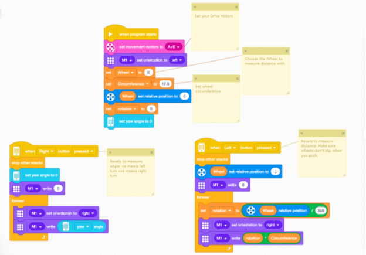

# Superpowered Dregos
## Spike Prime Code
In this folder you will find all of the code we created to drive our robot and complete SuperPowered Missions.
We also created a program to help us design our mission code.

### Measuring Code
The challenge we had when designing our code was to figure out how far our robot had to travel and how much it had to turn.
The next challenges was remembering and figuring out if the robot had to drive or turn in the opposite direction.
We found a Youtube video with a sample of code where the developer showed us how to display the distance the robot would travel when manually pushed.
We added some more code to that example that would show us how far and in what direction the robot would travel and turn.
When our team needs help figuring out what to tell the robot to do we switch to this code in our Spike Prime and write down the distance and degrees of turn the robot must make.

We can switch between what we are measuring by using the left or right buttons.

### Run Code
We decided to call a group of missions a Run. Then we could divide up the runs between teams. 
We had two identical robots to work with so we could split up the work and combine it later.
Our run code uses the same [Baseline](./FLL%20Superpowered%20Baseline.llsp) which contains three Make Blocks to make driving and turning more accurate and easy to use.

**BASELINE** 
* Drive by Gyro - Requires the power to turn the motors by and the +/- distance in cm you wish to travel
* Turn by Gyro - Requires the power to turn the motors by and the + (right) or - (left) degrees to turn by
* Drive by Time - Requires the time to continually drive by and the +/- power to turn the wheels by

The baseline also include a simple setup Block of code that describes your robot to the code it includes:
* Size of your wheels
* Orientation of your wheels
* Additional motors
* Default acclerations and behaviors when motors stop

When our code runs it first calls the setup block and waits, then our code can call any additional Run code and wait until that run code completes.
If we updated the Baseline then one of our team members was responsible to update all of the Run Code modules and notify the team of the changes.
